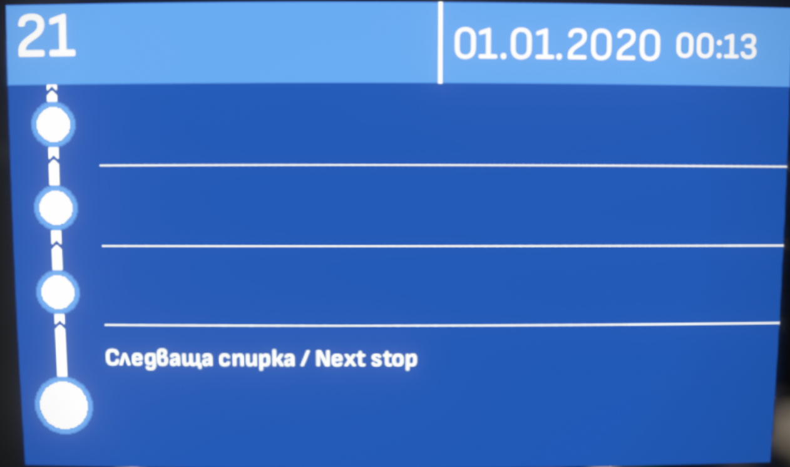
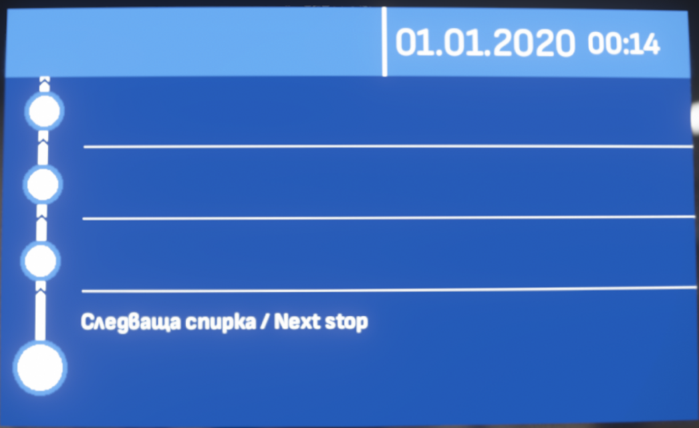

# [UwQ_'s Buses](https://steamcommunity.com/sharedfiles/filedetails/?id=3355235212)

## List of program codes with visualisation
**Keep in mind, that ones that end in "_" (underscore) are automatic and only supported on buses/trolleybuses with RGB displays.**

Codes consist of a letter (**b**, **t** or **e**) and a line id (1-4 numbers). The first one/two/three numbers indicate the line itself and the last number the direction (for example **b85**1 is to the 1st destination and **b85**2 is to the 2nd destination).

The letters are:
- **b** - <ins>B</ins>us lines
- **t** - <ins>T</ins>rolleybus lines (Higher resolution [more info](#more-info))
- **e** - Tram lin<ins>e</ins>s
- There are also ones that don't follow that pattern and are either words or abbreviations (like *bus*, *test*, *school*, *ter* /<ins>ter</ins>oll/, *bt* /<ins>b</ins>lue<ins>t</ins>ide/, etc.)

If you hold down the **Page Down** key, you will see a new input field. In it you need to enter additional destination / text ID (for now you'l have to find them manually, [more-info](#additional)).

<!-- Ones that start with "**s_**" will display text only on the front display while the others will only display the line number. -->

<iframe src="https://drive.google.com/file/d/1jkxPLIEW_YRySjPAC7d0Y7V2lbm7i9Xc/preview" width="640" height="480"></iframe>

A common pattern is that company logos/*for depot* signs are in range between 9900 and 9999 (like b9990, b9999, t9999, t9990 t9992, e9999); Special destinations (mostly present on buses) like trolleybus/tram/train replacements are usually in the 7000-8999 range, with some exceptions like the school bus (b6666) and special holiday bus (b6665).

Due to recent changes from the Sofia IBIS team, most temporary lines (with an **A** (like 86A, 79A, 108A, etc.)) now start with an **8** (86A -> 886*1*, 79A -> 879*1*, 108A -> 808*1*). This also applies to trolleybus lines.

## Route information displays

Buses with destination and stops displays are automatic and support *most* lines. They show the time since the level has started and the line number. For unsupported lines only the time will be shown and the line number field will be empty.

Supported:

Unsupported:

## More info
### Trolleybus display resolution
Trolleybuses' LED displays ([mostly](#useless-info)) consist of [bustec](https://bustec.eu/en/) ones, unlike the [Mobitec (Luminator)](https://www.luminator.com/en-uk/products/on-board-destination-displays.html) ones (of buses) using 128/96/32 x 16 px, bustec uses 144/108/36 x 19 px. display. To match as closely as possible to the IRL ones, the trolleybuses use these resolutions, meaning, that a trolley sign won't fit on a bus and vice-versa.

### Useless info
Trolleybuses Skoda 26Tr Solaris II (the non-articulated ones, probably the yellow Ikarus-es too) use [BUSE](https://www.buse.cz/en) displays, not bustec.

Some buses (depending on the brand/bus itself) also use bustec displays, but it would be a pain in the ass to make them too. That's why (for now) only trolleybuses are different (incomaptible with others).

#### Additional
Additional codes work the same way as ordinary ones. Letter + number.

E.g. **b7**, **t10**, etc.

For now they're not shown on the bottom of the preview because of some software limitations (my python script doesn't like them 🙃).